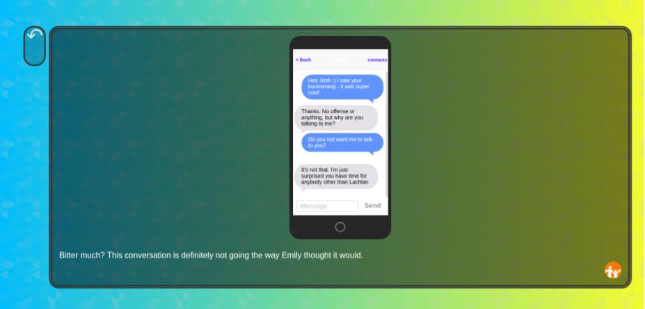
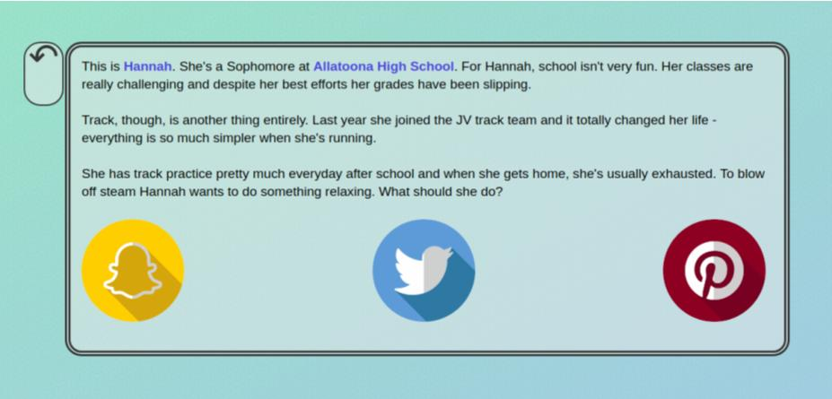
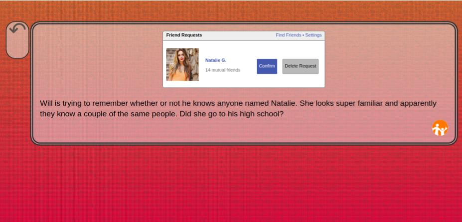

#Digital Decisions
##The story
Digital Decisions is a library of digital choose your own adventures created in 2016 as my first foray into development. As a core pillar of my initiative to reimagine cyber safety education, Digital Decisions was first deployed for use in Eastern Michigan University's Digital Divas conference, an event dedicated to introducing young women to careers in technology.

A resounding success, the scope was expanded to a small library of choose your own adventure games, each drawing from real world events to teach young adults about the risks and benfits of digitally connected lives.

These modules are currently used by [Washtenaw Area Council for Children](https://wwww.washtenawchildren.org) to administer cyber safety education across South East Michigan.

##The technology
Created using the [Twine Engine](http://twinery.org/) along with custom HTML and CSS. Each module underwent intense optimization including the creation of sprite sheets and minifying internal JS and CSS to reduce server calls. Stylistically edited for optimum usage on Kindle Fire tablets 

##Screenshots

